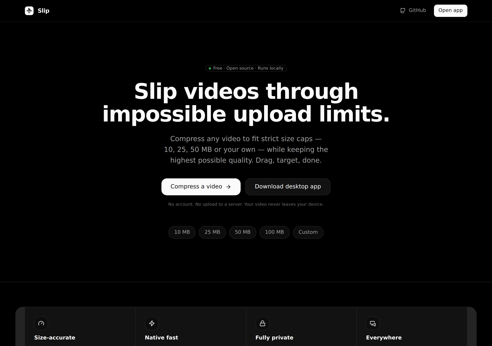
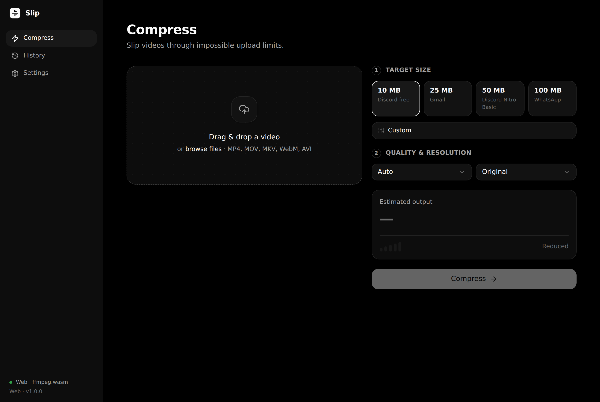
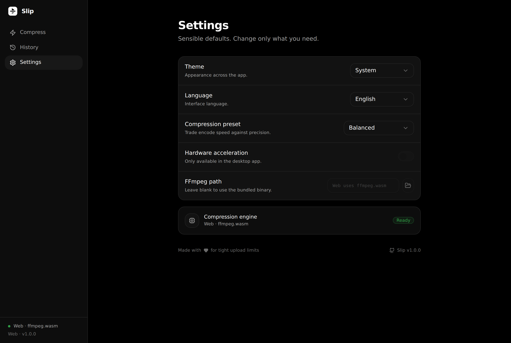

<div align="center">


# Slip

### Slip videos through impossible upload limits.

Compress any video to fit strict size caps — **10 MB, 25 MB, 50 MB, or custom** —
while preserving the highest possible visual quality.
Drag a video, choose a target, press Compress, download the result.

[](LICENSE)


**English** | **[Русский](README.ru.md)**

<br />



</div>

<br />

## What it does

Discord wants 10 MB. Gmail wants 25 MB. Your video is 180 MB. Slip fixes that.

It works out exactly the bitrate needed to land your video **under** a size limit —
using two-pass encoding for accuracy — then encodes locally with FFmpeg. Nothing
is uploaded to a server. Your video never leaves your device.

| | |
|---|---|
| **Size-accurate** | Two-pass bitrate targeting with a safety margin. Lands under the limit, not over. |
| **Native fast** | Bundled FFmpeg with hardware acceleration on desktop. |
| **Runs anywhere** | macOS, Windows, Linux, Android, and the web — one shared UI. |
| **Fully private** | 100% local. No account, no upload, no telemetry. |

<br />

<div align="center">


</div>

<br />

## How it works

Slip is a **single React frontend** that runs identically on native and web,
backed by a pluggable compression engine:

```
                 ┌───────────────────────────────┐
                 │   React + TypeScript + Tailwind│
                 │   Compress · History · Settings│
                 └───────────────┬───────────────┘
                                 │ CompressEngine interface
              ┌──────────────────┴──────────────────┐
              ▼                                      ▼
   ┌──────────────────────┐              ┌────────────────────────┐
   │  NativeEngine        │              │  WasmEngine            │
   │  Tauri → Rust        │              │  ffmpeg.wasm (browser) │
   │  bundled FFmpeg      │              │  zero-install fallback │
   │  two-pass, HW accel  │              │  single-pass ABR       │
   └──────────────────────┘              └────────────────────────┘
```

The engine is chosen automatically: inside the Tauri shell you get the fast
native path; on the web you get the WASM fallback. The UI, the size math, and
the design system are shared.

### The size math

The core of Slip lives in [`src/engine/bitrate.ts`](src/engine/bitrate.ts):

```
total_bits   = target_bytes × 8 × safety_margin
video_bits   = total_bits − audio_bits − container_overhead
video_bitrate = video_bits ÷ duration          (never above source bitrate)
```

Audio bitrate scales down for tight budgets, dimensions honour the resolution
cap, and the plan is verified against the target before encoding.

<br />

## Project structure

```
slip/
├── src/                      # Shared React frontend
│   ├── engine/               # Compression engine (the product core)
│   │   ├── bitrate.ts        #   size → encode-plan math
│   │   ├── native.ts         #   Tauri/Rust path
│   │   ├── wasm.ts           #   ffmpeg.wasm path
│   │   └── index.ts          #   engine selection
│   ├── components/           # UI: UploadZone, VideoPreview, LogsPanel…
│   │   └── ui/               # Primitives: Button, Card, Dropdown, Slider…
│   ├── screens/              # Compress · History · Settings · Landing
│   ├── hooks/useCompressor.ts# Orchestration state machine
│   └── lib/                  # store (zustand), utils, formatting
├── src-tauri/                # Rust backend
│   └── src/
│       ├── lib.rs            # Tauri commands + job registry
│       ├── ffmpeg.rs         # binary discovery + version
│       ├── probe.rs          # ffprobe → VideoInfo
│       └── compress.rs       # two-pass encoder + progress events
├── scripts/gen_icons.py      # Dependency-free icon rasterizer
└── .github/workflows/        # CI: web build + native installers
```

<br />

## Development

**Prerequisites:** Node 20+, Rust (stable), and FFmpeg on your PATH (or set it in Settings).

```bash
# Install
npm install

# Web (PWA) dev server
npm run dev

# Desktop app (Tauri) dev
npm run tauri:dev
```

### Build

```bash
npm run build          # web / PWA  → dist/
npm run tauri:build    # native installer for the current OS
```

App icons are generated from the source mark with:

```bash
python3 scripts/gen_icons.py     # then: npm run tauri icon src-tauri/icons/icon.png
```

<br />

## Platform targets

| Platform | Artifact | Engine |
|----------|----------|--------|
| Windows  | `.exe` / `.msi` | Native FFmpeg |
| macOS    | `.dmg` | Native FFmpeg |
| Linux    | `.AppImage` / `.deb` / `.rpm` | Native FFmpeg |
| Android  | `.apk` | Native FFmpeg |
| Web      | PWA | ffmpeg.wasm |

<br />

## Design system

Monochrome, calm, engineered — Apple software built by GitHub engineers.

- **Colour** — pure greyscale (`#000 → #FFF`); green for success, red for fatal errors only
- **Type** — Inter, large headings, generous rhythm
- **Icons** — Lucide, thin stroke
- **Radius** — 8–16px, soft
- **Motion** — 150ms, opacity and small scale only

Design tokens live as CSS variables in [`src/index.css`](src/index.css) and are
consumed through Tailwind semantic classes (`bg`, `fg`, `border`, `accent`…),
so the same class resolves correctly in both light and dark themes.

<br />

---

## Tags & Keywords (SEO & Promotion)

video compressor, video compression, ffmpeg, tauri, react, wasm, ffmpeg-wasm, desktop app, pwa, video converter, compress video, discord, discord compressor, rust, typescript, cross-platform, utility, open-source, developer-tools, local-first app.

<div align="center">

Made for tight upload limits · **MIT Licensed**

</div>
